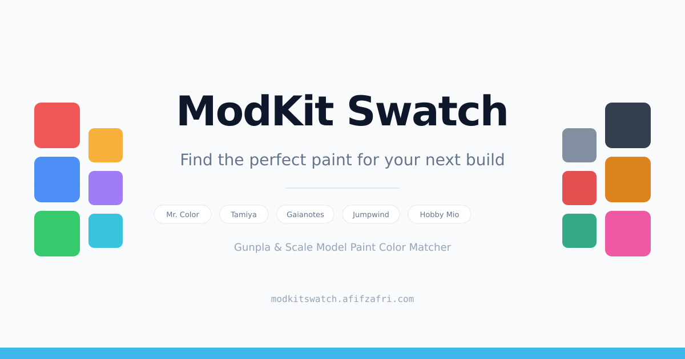

# ModKit Swatch

> Find the perfect paint match for your Gunpla, Gundam model kit, or any scale model.

Upload a reference photo, click to sample any color, and instantly get ranked paint matches across major hobby brands.



## Features

- Upload any reference image (JPEG, PNG, WebP) via drag-and-drop or file browser
- Click anywhere on the image to sample a color, with a magnifier loupe for precision
- CIE2000 Delta E color matching across 600+ hobby paints
- Filter by brand, finish (gloss, flat, semi-gloss, metallic), and paint type
- Paint bottle/swatch images shown alongside results
- Save paints to a palette and export as a text list
- Fully client-side, no backend or signup required

## Supported Brands

Mr. Color, Tamiya, Gaianotes, Jumpwind (Meka & Neo), Hobby Mio, QNC, Sunin7

## Quick Start

```bash
npm install
npm run dev
```

App runs at `http://localhost:3000`.

## Tech Stack

- **Next.js** (App Router), TypeScript, Tailwind CSS
- **chroma-js** for color math (hex/rgb/lab conversions, Delta E CIE2000)
- **lucide-react** for icons
- Fully static, deployable to Vercel or any static host

## Paint Database

Paint data lives in `data/paints.json`. Each entry looks like this:

```json
{
  "brand": "Mr. Color",
  "code": "C5",
  "name": "Blue",
  "hex": "#1030a0",
  "finish": "gloss",
  "type": "lacquer",
  "suitableFor": { "airbrush": true, "handPainting": false }
}
```

Brands, finishes, and types are derived from the data at runtime. No code changes needed to add new values.

### Paint Images

Place paint images in `public/paints/{brand-slug}/{code}.jpg`. The app automatically looks for a matching image and falls back to a hex color swatch if none exists.

## License

This project is licensed under the `MIT license` - see the `LICENSE` file for details.
